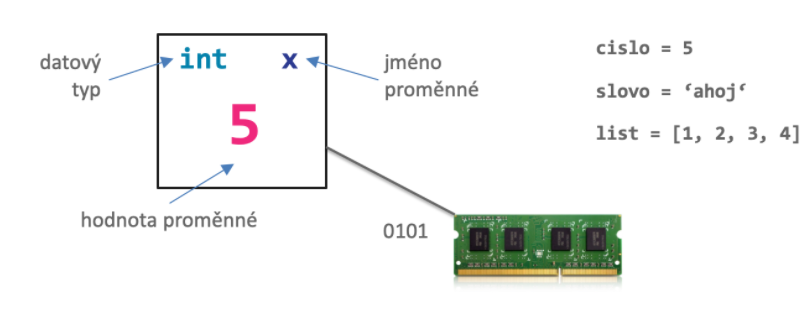
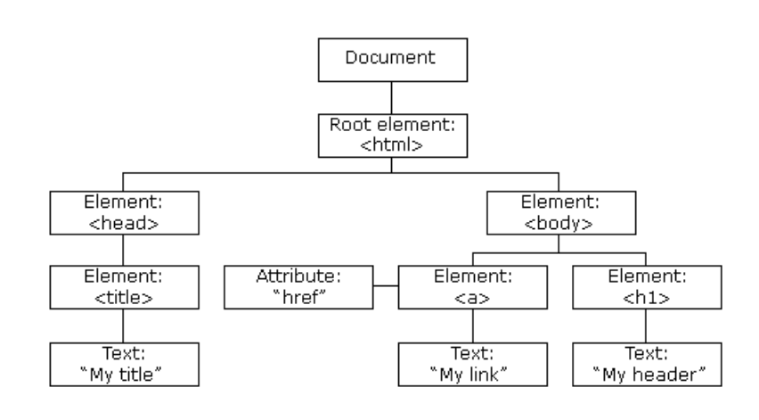

# Osnova
<span style="font-size: 20px">

1. Úvod

2. JavaScript

3. Přehled / rekapitulace základů JavaScriptu
    - základní funkce alert, prompt, console.log
    - datové typy
    - proměnné (primitívní datové typy a práce s nimi)
    - objekty
    - pole
    - vlastní funkce
    - podmínky
    - cykly
    - DOM -> projekt Album

4. Projekt Album
    - práce s DOMem
    - eventy
    - REST API
    - formuláře
    - localStorage

</span>

# Úvod

<span style="font-size: 20px">

- Zdeněk Sotolář
    - Backend vývojář ve firmě Futured. Makáme na mobilních aplikací a my, backend tým, se staráme o vývoj REST API a DevOps
    - Kromě backendu i vývoj frontendových aplikací, převážně administrace, dashboardy
    - Stack: PHP, MySQL, Docker, Golang, Node.js, AWS, Vuejs, React
    - Lektor, kouč Czechitas

- Jak to bude dnes probíhat?

</span>

# JavaScript

<span style="font-size: 20px">

- Interpretovaný programovací jazyk, netypový, podpora objektového programování (prototype-based)
- Světlo světla spatřil roku 1995 jako součást prohlížeče Netscape
- Původní název LiveScript, později změněn na JavaScript, díky rostoucí popularitě programovacího jazyka Java
- Roku 1997 vznikl standard ECMA-262 popisující jádro jazyka JavaScript - Dnes známý jako ECMAScript
- Nejvejší pokrok v jazyce přišel s verzí ES2015 - ES6 (podpora tříd, rest a spred operátory, moduly)
- Dnes máme ES7 (ECMAScript 2016), ES8 (ECMAScript 2017), ES9 (ECMAScript 2018). Stále experimentální

</span>

<span style="font-size: 20px">

- Babel https://babeljs.io/
- Webpack https://webpack.js.org/
- TypeScript https://www.typescriptlang.org/
- Když nevím co funguje a ne https://caniuse.com/
- Rozsáhlá dokumentace JS https://developer.mozilla.org/en-US/docs/Web/JavaScript
- Ukázka tříd a jejich podpory https://developer.mozilla.org/en-US/docs/Web/JavaScript/Reference/Classes

</span>

<span style="font-size: 20px">

- Použití jako embedded jazyk
- Server-side jazyk zapomocí Node.js
- Technologie Flash - ActionScript
</span>

# Datové typy

<span style="font-size: 20px">

| Primitivní datové typy  |  Hodnota |
|---|---|
| <span style="color:#EF287C"><b>integer</b></span>  | 5 |
| <span style="color:#EF287C"><b>float</b></span>  | 5.5 |
| <span style="color:#EF287C"><b>string</b></span>  | "5" |
| <span style="color:#EF287C"><b>boolean</b></span>  | true |
| <span style="color:#EF287C"><b>undefined</b></span>  | undefined |
| <span style="color:#EF287C"><b>object</b></span>  | null |


| Složené datové typy  |  Hodnota |
|---|---|
| <span style="color:#EF287C"><b>object</b></span>  | ["name", "age"] |
| <span style="color:#EF287C"><b>object</b></span>  | {name: "Patrik", age: 45} |
| <span style="color:#EF287C"><b>function</b></span>  | function() {} |

</span>





<span style="font-size: 20px">

```javascript
console.log(typeof 5)
console.log(typeof 5.5)
console.log(typeof "5")
console.log(typeof true)
console.log(typeof undefined)
console.log(typeof null)

console.log(typeof ["name", "age"])
console.log(typeof {name: "Patrik", age: 45})
console.log(typeof function() {})
```

</span>

# DOM

> <span style="font-size: 25px">DOM je objektově orientovaná reprezentace XML nebo HTML dokumentu. DOM je API umožňující přístup či modifikaci obsahu, struktury, nebo stylu dokumentu, či jeho částí.</span>

